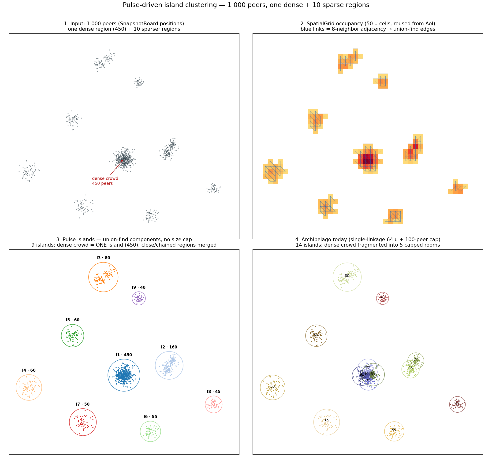
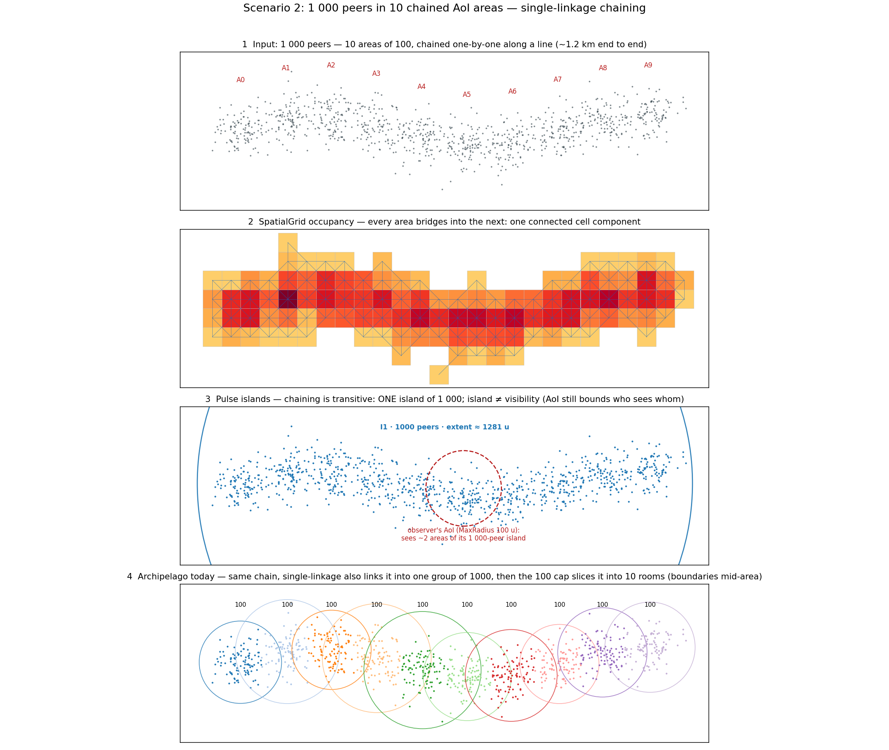
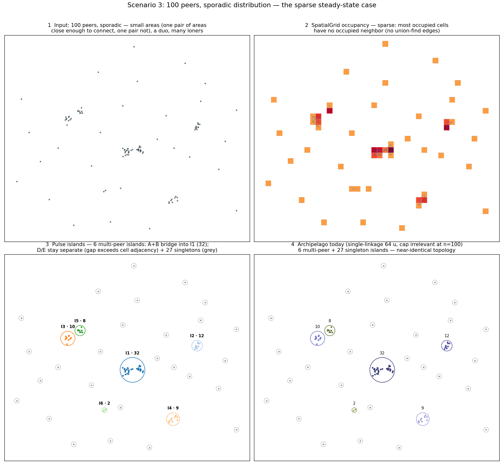

# Peer Clustering as a Layer on Top of Pulse AoI

Status: **iteration 1 implemented** (§3.1–3.4, §3.6, §3.7 ship; §3.5 stats endpoints are iteration 2). Moves island authorship from Archipelago Core (see `archipelago-workers/docs/island-clustering-algorithm.md`) into Pulse, derived from the same spatial data that drives AoI.

**Vocabulary.** Pulse's grouping is a **cluster**. "Island" is reserved for archipelago's concept and the wire contracts that carry it — the `engine.islands` subject, `IslandStatusMessage`/`IslandData`, `IslandChangedMessage`, and the `/islands` stats paths. The two differ materially: clusters have no size cap, are realm-partitioned, and carry no transport connection details.

## 1. Why

Archipelago clusters players from WS-connector heartbeats; Pulse independently decides visibility via AoI. Same positions, two pipelines, different latencies (2 s flush vs 50 ms tick) — island membership and avatar visibility can disagree (a documented archipelago issue). The current algorithm also has unstable IDs (split minorities always get new islands), a 100-peer cap that fragments connected crowds, and O(peers²) island-pair intersection tests.

Requirements for the new layer:

- No cluster size cap.
- Same idea — proximity-connected groups with hysteresis — not the same algorithm.
- A read-mostly layer over AoI infrastructure; never touches the per-tick hot path.
- Stable: IDs survive churn; boundary players don't flap.

## 2. What Pulse AoI provides

- **`RealmSpatialGrids`** — one `SpatialGrid` per realm, created on a realm's first occupant and dropped with its last, plus the per-peer record of which realm and cell each slot occupies. Realm isolation is structural: a grid holds one realm's peers and nothing else, so no consumer compares realms. Written incrementally on every snapshot publish under one shared write lock; lock-free reads.
- **`SpatialGrid`** — cell index for one realm, 100-unit XZ cells (`SpatialHashAreaOfInterest:CellSize`; the options class default is still 50), packed int64 keys. Occupant sets are copy-on-write, so a reader that holds one keeps iterating a consistent cell.
- **`SpatialHashAreaOfInterest`** — resolves the observer's realm grid once, then scans neighboring cells within it, `MaxRadius` 100, distance tiers driving 50/100/200 ms update rates.
- **`SnapshotBoard`** — seqlock latest state per peer (position, parcel, realm); single writer per slot, lock-free reads from any thread.
- **`PeerSimulation`** — per-worker tick: AoI query → view diff → messages. Workers own disjoint peer stripes; cross-worker coordination is forbidden.

AoI is pairwise and observer-centric — no group concept exists. Clusters are a global derived artifact, so they belong in one central computation over the shared boards, not in per-worker simulation.

## 3. Design

### 3.1 Components

**`ClusterTracker`** — one dedicated `BackgroundService` thread. Every `PassIntervalMs` (1 s) it runs a clustering pass over thread-safe shared state and publishes to the `ClusterBoard`. It writes nothing workers own. `RunPass` is `internal` so tests and benchmarks drive passes deterministically instead of racing the timer.

**`ClusterBoard`** — an immutable `ClusterPass` swapped atomically (one `Volatile.Write`): `clusterIdByPeer` array plus per-cluster metadata (id, realm, count, center, radius) and per-peer detail for stats. A separate board is justified by the repo rule: globally derived, single writer, never worker-mutated.

Working buffers are fields cleared between passes rather than reallocated. The published `ClusterPass` is necessarily fresh each pass, since readers hold it by reference — it is the bulk of the per-pass allocation (§3.2).

### 3.2 Algorithm: union-find over occupied grid cells, one realm at a time

Cluster at cell granularity, reusing the AoI grids — no second grid:

1. **Enumerate.** `RealmSpatialGrids.GetRealmGrids` yields the realms that hold peers; each realm's `GetOccupiedCells` yields its occupied cells with occupants, lock-free over the existing `ConcurrentDictionary`. Nodes are cells, and a node's realm is the grid it came from — partitioning never reads a realm off a snapshot or compares two. (The debounce in §3.3 does compare the last *published* realm, which is change detection, not partitioning.) Peers with no wallet in `IdentityBoard` are skipped: they cannot be addressed on the feed. Peers with no realm never appear, because nothing placed them in a grid.
2. **Union.** Weighted union-find with path halving over 8-neighbor occupied cells, run per realm — the cell-key index that neighbor probes consult holds one realm at a time, which is what confines a cluster to a single realm. Two peers in adjacent cells are between 0 and `2 · CellSize · √2` apart — **0–283 units** at the configured 100 u — a proxy for archipelago's 64-unit join distance that is 4.4× coarser; boundary noise is absorbed by the dwell debounce (§3.3). Effective join range follows the AoI `CellSize`: one spatial resolution for visibility and clustering.

   Two consequences of the 100 u setting worth stating plainly. Pulse will merge groups archipelago would have kept apart far more often than a 50 u grid would, so the §5 shadow-mode comparison should expect systematically fewer, larger clusters rather than a near-match. And since the join band (283 u) now exceeds `MaxRadius` (200 u) by a wider margin, two peers being in one cluster while never being mutually visible is ordinary rather than a chaining edge case — see the "Cluster ≠ visibility" note below.
3. **Component → cluster.** Each root is a cluster; count, centroid and radius are computed in the same sweep, on the XZ plane to match what archipelago reported.

No cap: a connected crowd is one cluster, deterministically.

**Limits.** Hard ceiling: instance capacity (`Transport.MaxPeers`, 4095 — fixed arrays, no cross-instance clustering), further confined per realm. The algorithm adds none: O(N + C), C = occupied cells. Measured **~395 µs/pass at the 4095 ceiling** — Genesis City-sized world, cold working set, `ClusterTrackerBenchmarks` scenario `CeilingUniform` (~321 µs warm; ~230 KB of gen0 per pass, almost all of it the immutable `ClusterPass` the readers hold). The documented scenarios cost far less: ~8 µs for the 100-peer sparse case, ~31–35 µs for the 1 000-peer ones.

That is 0.04% of one core at the 1 Hz cadence, so the pass is not a scaling concern below a capacity change; an earlier estimate of "well under 1 ms at 10k peers" was optimistic, since 10k is not reachable on one instance anyway. The practical bound is density and belongs to AoI: clusters don't affect fan-out, so spread clusters can reach instance capacity while dense crowds hit per-observer AoI fan-out (~n² within `MaxRadius`) first. Downstream, one cluster maps to one LiveKit room, whose single-node capacity is ~low thousands (§3.6).

"Cold" throughout is `Pass + churn` minus `Churn only` — a difference of means, so its error is the sum of both rows'. Quote it rather than the warm figure: `Pass` repeats over an unchanging grid and keeps its working set in cache, which a second of production tick and packet traffic does not.

**Percolation limit — at capacity on a full-size realm, the partition collapses.** Cell-adjacency clustering is site percolation on the grid: once the occupied fraction passes the 8-neighbour (Moore) threshold of ≈ 0.407, the occupied cells form one giant connected component and every peer lands in one cluster. Genesis City (4800 u) at 100 u cells is 48 × 48 = 2304 cells, so `MaxPeers` 4095 spread uniformly gives λ ≈ 1.78 peers/cell and an occupied fraction of `1 − e^−λ` ≈ **0.83** — roughly twice the threshold. Measured (`ClusterTrackerBenchmarks`, `CeilingUniform`): 1904 occupied cells, **2 clusters, the larger holding 4091 of 4095 peers**.

At 50 u the same population occupies ≈ 0.36 of 9216 cells, just *below* threshold — which is why the design's worked examples partitioned sensibly. Doubling the cell size moved the shipping configuration from one side of the percolation transition to the other. Consequences: sticky IDs and the dwell debounce have nothing to stabilise at high density; gatekeeper maps one cluster to one LiveKit room by design (§3.6), so a percolated ~4095-peer cluster becomes a single room, well past the ~low-thousands single-node audio guidance — if that ever needs bounding, the mechanism is tracker-level in Pulse (§7); and the exact-distance refinement in §7 becomes the mechanism that decides whether clustering means anything at capacity. This bounds usefulness, not correctness — the pass still runs in well under a millisecond, and sparse realms (the common case, scenario 3) are unaffected.

#### Worked examples

> These three scenarios and their illustrations were produced at a **50-unit** cell size, before the configured value settled at 100. At 100 u the same inputs merge more aggressively, so every cluster count below is a lower bound on merging and an upper bound on cluster count. The qualitative comparisons against archipelago — cap fragmentation, chaining, the sparse-case match — all still hold; the specific counts do not. Regenerating the illustrations is tracked in §7.
>
> All three are reproduced as runnable benchmarks — `ClusterScenario` in `src/DCLPulseBenchmarks`, which prints the realized topology at setup. At 100 u they still land on the documented partitions: scenario 1 gives 9 clusters with the crowd intact at 450, scenario 2 one cluster of 1 000, scenario 3 the 32-peer bridge plus singleton loners. What does *not* survive the cell-size change is a densely populated realm — see the percolation note above.

**Scenario 1 — one dense region (450) + 10 sparser regions, 1 000 peers:**

Panels: input → grid occupancy with union-find edges → Pulse result → today's archipelago. Pulse: 9 clusters; the dense crowd is one cluster of 450; close (C2, 160) and chained (C3, 80) regions merge. Archipelago: 14 islands; the cap slices the dense crowd into 5 overlapping rooms whose boundaries cut through the crowd.

**Scenario 2 — chaining worst case. 10 areas of 100 in a line, each bridging into the next (~1.2 km):**

Adjacency is transitive: one cluster of 1 000, extent ~1 280 units. Notes:

- **Cluster ≠ visibility.** The dashed circle is one observer's AoI (~2 of 10 areas). Chain ends share a cluster but never exchange state. Consumers must not read "same cluster" as "near each other".
- **Chaining is inherited, not new** — archipelago links the same chain into one group, then the cap slices it into 10 rooms with merge-order-dependent membership. Pulse reports the chain honestly and stably.
- **If bounded extent is ever needed:** a max-diameter constraint in the tracker (split at the sparsest bridging cell). Not in iteration 1; extent is already reported (center, radius), so consumers can detect chains.

**Scenario 3 — sparse steady state. 100 peers: small areas (one pair connects, one doesn't), a duo, many loners:**

The common case, and the migration is invisible in it: sparse cells have no occupied neighbors (near-zero union edges); adjacent areas bridge (C1, 32); the near-but-separate pair stays split; each loner is a singleton cluster — archipelago's semantic exactly. On this input both algorithms produce the **identical partition** (672/672 co-membership pairs). Divergence exists only in scenarios 1–2: cap fragmentation and the boundary band (50–141 u as illustrated; 100–283 u at the configured cell size, which widens it considerably).

### 3.3 Stability

**Sticky IDs.** Each pass, a component inherits the ID of the previous cluster sharing the most members (ties → older). Unmatched components get fresh IDs, `{IdPrefix}{n}` from a monotonic counter. IDs survive churn; on split, continuity (not size) decides who keeps the ID.

Two subtleties the implementation had to get right:

- **Identity continuity is measured against the previous pass's *computed* assignment, not the *published* one.** These are separate arrays. Conflating them starves the debounce: a fragment whose reassignment is still being held back would look unassigned to the inheritance step, be minted a fresh ID every pass, and so never see its candidate repeat — its streak would never reach `DwellPasses` and it would never be reassigned at all. Caught by test, not by review.
- **When two components claim the same previous ID, the larger overlap wins; an exact tie goes to whichever was discovered first.** Discovery order follows grid enumeration, so for two equal-sized fragments the winner is arbitrary. Both outcomes are equally correct, and archipelago made no guarantee here either.

**Dwell debounce.** Temporal hysteresis instead of archipelago's join/leave distances: a published assignment changes only after `DwellPasses` (3) consecutive passes agree. Immediate exceptions: first assignment, teleport, realm change, and deletion of the peer's previous cluster — cases where the published assignment is already known to be wrong, so waiting would keep serving a stale room. State is one `PeerClusterState` per peer (published cluster, published realm, candidate, streak).

Realm is part of the published identity, not just the cluster ID: a crowd that migrates realm together overlaps itself completely and so keeps its sticky ID, but the feed carries realm alongside the ID, so that change still has to be published.

**Teleport detection is best-effort.** The bypass reads `IsTeleport` on the peer's latest snapshot. A teleport followed by ordinary movement inside the same 1 s pass interval is therefore observed as a normal reassignment and goes through the debounce. Cross-realm teleports are always immediate, since the realm-change bypass catches them independently.

**Recycled peer slots must be forgotten.** `PeerIndex` is a recycled ENet slot, so per-peer tracker state for a departed peer is cleared each pass. Left behind, it would be inherited by whichever wallet lands on that slot next and make its first assignment look like an unchanged one.

Stability is load-bearing: ID churn breaks dashboard continuity and forces LiveKit room rejoins downstream.

### 3.4 Consumption: server-side only

No client protocol change — no cluster message on the client wire, no worker involvement. Two consumers:

- **Stats/monitoring** — served by Pulse directly (§3.5).
- **Comms Gatekeeper as listener** — Pulse is the sole author and publishes assignment changes to NATS (§3.6); gatekeeper mints LiveKit conn-strings and re-emits the existing `island_changed` message, so WS Connector and clients are untouched. Archipelago-core is removed, not bridged.

### 3.5 Stats served by Pulse — *iteration 2, not implemented*

"Stats" here means entity-level JSON (cluster rosters, wallet ↔ position ↔ parcel records) consumed by product surfaces — distinct from Prometheus `/metrics`, which stays the aggregate time-series endpoint (cluster count, pass duration) for dashboards and alerting.

Today: WS Connector → NATS heartbeats + core → `engine.islands` → stats service REST (`/peers`, `/islands`, `/parcels`, `/hot-scenes`; per peer: wallet, position, parcel, lastPing). Pulse already holds all of it — wallet (`IdentityBoard`), position/parcel/realm/freshness (`SnapshotBoard`), assignment (`ClusterBoard`) — and the tracker already attaches per-peer detail to each published pass, so HTTP can serve the last pass at zero marginal cost, ≤ `PassIntervalMs` stale (vs 2 s flush + 60 s heartbeat timeout today). The data is in place; the endpoints are not.

Surface: `GET /islands`, `/islands/{id}`, `/peers`, `/parcels` on the existing `HttpService`, response-compatible with archipelago stats. The `/islands` paths keep archipelago's spelling for URL compatibility even though they serve clusters. These are stats endpoints only — the assignment feed is NATS (§3.6). Exception: `/hot-scenes` needs Catalyst metadata — it moves to comms-gatekeeper, which already has a Catalyst `content-client`; Pulse grows no Catalyst client.

### 3.6 Feed: Pulse → NATS (direct)

Pulse publishes per-peer assignment changes **directly to NATS**: `peer.{addr}.cluster_change`, carrying `decentraland.pulse.PeerClusterChange { cluster_id, realm }` from `decentraland/pulse/pulse_clusters.proto`, emitted whenever a peer's *published* (post-debounce) assignment changes. The wallet is lower-cased so one wallet always maps to one subject regardless of the checksum casing the auth chain carried.

Comms-gatekeeper subscribes, mints the LiveKit conn-string (ban check is authority-local — its own store), and publishes the existing `engine.peer.{addr}.island_changed` `IslandChangedMessage`. In the shipped message `islandId` is the room name `island-{clusterId}` — not the bare `C{n}` id that `engine.islands` carries — `fromIslandId` is the previous room name when known (per-wallet LRU, 1 h TTL), and `peers` is always empty; unity-explorer was verified to read only `connStr`. WS Connector and clients are untouched; archipelago-core is removed rather than bridged. (An earlier revision proposed core polling `GET /islands` over HTTP; dropped in favor of direct NATS once core's removal moved into iteration 1.)

`PeerClusterChange` is deliberately **not** archipelago's `IslandChangedMessage`. That message carries `conn_str` — a LiveKit host plus a signed 5-minute JWT — and its producer also runs a per-user ban check to decide who is admitted to the room. Both are token-issuer concerns that stay with gatekeeper, so Pulse publishes only what Pulse knows.

Why NATS works here where the topology-snapshot feed ruled it out: per-peer *change events* are small and self-contained — the 1 MB payload concern applied to full-topology snapshots, which this feed doesn't carry. Both consumers in the chain (gatekeeper, WS Connector) are NATS-side services, and event semantics match the consumer: gatekeeper acts per change, not per snapshot. The cost is Pulse's first broker dependency — **publish-only, config-gated, fail-soft**: a NATS outage stalls conn-string delivery, never the tracker or simulation.

Iteration-1 output is three subjects:

| Subject | Payload | Cadence |
| --- | --- | --- |
| `peer.{addr}.cluster_change` | `decentraland.pulse.PeerClusterChange` | per published assignment change |
| `engine.islands` | `kernel.comms.v3.IslandStatusMessage` | per pass |
| `engine.discovery` | `kernel.comms.v3.ServiceDiscoveryMessage` | timer, default 10 s |

`engine.islands` reports `max_peers = 0` — clusters are uncapped, and advertising zero is more honest than implying a bound that no longer exists. Note that archipelago-stats passes the value straight through to `GET /islands`, so that field reads 0 after cutover where it read 100 before.

**Delivery: a coalescing outbox, not one queue.** The two feeds supersede differently, and treating them alike loses data:

- `engine.islands` is a whole-world snapshot — a newer one fully replaces an undelivered one. It lives in a single latest-wins slot and can never occupy more than one delivery slot or crowd out an assignment.
- `peer.{addr}.cluster_change` supersedes only **per peer**. Two peers' events carry disjoint information, so they are held one entry per peer: a peer's newer assignment replaces its own older one, and one peer's event can never displace another's.

A single shared FIFO with oldest-first eviction — the original design — would have been wrong for the second case: it could discard peer A's assignment to make room for peer B's, leaving A addressed by a stale cluster until its next reassignment, which may never come if A stops moving. Genuine loss is now confined to sustained overload with more than `Nats:ChannelCapacity` distinct peers pending at once, and is counted separately (`dropped`) from benign superseding (`superseded`).

**Ordering: topology first.** Within a pass the snapshot is emitted before the per-peer events that reference it, so a consumer resolving a cluster id against the topology sees one that already contains it rather than joining against the previous pass. (Shipped gatekeeper does not subscribe to `engine.islands`; stats is the topology consumer.) This is best-effort, not a guarantee: NATS preserves order per connection to a given subscriber, and gatekeeper and stats are separate subscribers on separate subjects. Consumers must tolerate an unknown cluster id. The one guarantee that does hold is the one that matters most: for a single peer, its own `cluster_change` events are strictly ordered.

`engine.discovery` bypasses the outbox and publishes straight to the connection — a heartbeat delayed behind a backlog defeats its own purpose. It can therefore overtake queued island data; harmless, since archipelago-stats consumes health and user count independently of topology.

Delivery semantics remain at-most-once, so a dropped event still leaves a peer in its previous room until its next reassignment. The outbox makes that far less likely — an outage now retains each peer's latest assignment rather than discarding it — but the design's original mitigation, a low-rate periodic re-publish sweep, is **not implemented**. `GET /islands` (once it exists, §3.5) remains the reconciliation path.

**Connection ownership.** One `NatsPublisher : BackgroundService` owns the connection, using `NATS.Client.Core` — the core of the official client, pure managed, no native deps. The `NATS.Net` umbrella package additionally pulls JetStream / KeyValueStore / ObjectStore / Services, none of which a publish-only feed uses. The `<PackageReference>` still triggers the Docker-image rebuild rule.

**Reconnection.** Transport-level reconnection is the client's job and its defaults suit a fail-soft feed: unlimited retries (`MaxReconnectRetry` −1) with 2–5 s backoff plus jitter. Two things are layered on top:

- `IgnoreAuthErrorAbort = true`. By default the client gives up permanently once the server returns the same auth error twice, which would turn a rotated credential into a silently dead feed recoverable only by restarting Pulse.
- A **supervision loop** around the connection and its two loops. Broker loss is handled inside the client, so the pipeline exiting means it *faulted* — the loop rebuilds the connection after a 5 s backoff instead of returning, which would otherwise leave the feed dead for the rest of the process lifetime. The connected gauge is paired on the way out so a rebuild cannot leave it stuck at 1.

Verified by stopping and restarting the broker under a live publisher: `connected` 1 → 0 → 1, `reconnects` 1, publishing resumed, and `dropped` stayed 0 — the outbox retained state across the outage.

**Wire compatibility.** `engine.islands` and `engine.discovery` must match `@dcl/protocol` `archipelago.proto`, so Pulse's proto generation includes that one file — listed individually rather than as a `kernel/comms/v3` glob, since the rest of v3 is the legacy comms generation Pulse replaces.

This surfaced a latent gap: `ServiceStatus` / `ServiceDiscoveryMessage` were **never merged to `@dcl/protocol` main**. They were authored in September 2023 on `feat/default-realm` (`10343e9`, then `861829b` widening `current_time` to `uint64`) and reach archipelago only through a pinned CDN *branch build* whose source commit no longer exists in the repo. Generating from the repository rather than the tarball made the gap visible; restored by [protocol#453](https://github.com/decentraland/protocol/pull/453). `current_time` must be `uint64` — epoch milliseconds overflow `uint32`, and archipelago-stats' health check is a delta against `Date.now()`, so a truncated timestamp reads as permanently unhealthy.

**Test seam:** `IClusterFeedPublisher` (NSubstitute). `Nats` unset = feed disabled, stats-only mode — the rollback story.

**Consequences owned by gatekeeper:**

- *One cluster = one room, verbatim* — gatekeeper maps each cluster to the LiveKit room `island-{clusterId}` with no sharding or re-partitioning, **by design**: Pulse is the single source of cluster composition. LiveKit rooms are single-node-bound (~low thousands audio; 100 audio subscriptions per participant), and the percolation result above makes the exposure concrete: at capacity on a full-size realm, one ~4095-peer room. If room size ever needs bounding, it happens in Pulse at the tracker level, never in consumers (§7).
- *Delivery reach* — a wallet connected to Pulse but without a WS Connector session gets events nobody forwards (harmless); the reverse (WS session, no Pulse connection) gets no cluster. Expose a mismatch metric.

### 3.7 Configuration

| Option (`Clusters`) | Default | Meaning |
| --- | --- | --- |
| `Enabled` | false | Feature flag (set in both `appsettings.json` and `appsettings.Development.json`) |
| `PassIntervalMs` | 1000 | Tracker pass cadence |
| `DwellPasses` | 3 | Passes before a reassignment publishes |
| `IdPrefix` | `C` | Cluster ID prefix (replaces archipelago `ROOM_PREFIX`) |

| Option (`Nats`) | Default | Meaning |
| --- | --- | --- |
| `Url` | — | Broker URL; unset = feed disabled (stats-only mode) |
| `ServerName` | `pulse` | Reported as `server_name` on `engine.discovery` |
| `DiscoveryIntervalMs` | 10000 | Heartbeat cadence; must stay well under archipelago-stats' 90 s health window |
| `ChannelCapacity` | 1024 | Max distinct peers with an undelivered assignment |

The broker URL is read from **either** `Nats__Url` or the flat `NATS_URL` — the latter is the name archipelago's services read (`config.requireString("NATS_URL")`), so one CI-injected secret serves both. `Nats__Url` wins if both are set. Because an unresolved URL fails soft rather than erroring, `dcl_pulse_nats_connected` and the startup log are the only signals that a secret never arrived.

**The two flags are independent, and that is the safe default.** `Clusters:Enabled` ships **true**, so the tracker runs everywhere and its metrics are populated; `Nats:Url` ships empty, so nothing is published. A deployment therefore gets shadow mode (§5 step 1) by default and becomes an author only once a broker URL is injected — which is also the rollback: clear the URL and the feed stops while clustering keeps running.

**Metrics** (see [metrics.md](metrics.md)): `dcl_pulse_clusters`, `dcl_pulse_cluster_passes_total`, `dcl_pulse_cluster_pass_duration_us_total`, `dcl_pulse_cluster_reassignments_total`, and for the feed `dcl_pulse_nats_{published,dropped,superseded,reconnects}_total` plus `dcl_pulse_nats_connected`. `dropped` is the actionable one; `superseded` is expected under load.

## 4. Comparison

| | Archipelago Core | Pulse clusters |
| --- | --- | --- |
| Input | NATS heartbeats (≤ 2 s stale, 60 s disconnect lag) | `SnapshotBoard` (fresh, ~5 s cleanup) |
| Granularity | peer-pairwise single-linkage, 64/80 | union-find over 100 u cells of the realm's `SpatialGrid` (join band 0–283 u) |
| Stability | ID survives largest fragment only; merge-order dependent | sticky IDs + dwell debounce |
| Size cap | 100, blocks merges | none; bounding, if ever needed, is tracker-level (§7) |
| Cost | O(pairs) per flush | O(N + C) per pass, off hot path |
| Consistency with visibility | none | same boards as AoI |

## 5. Migration

Plan of record: [Archipelago ⇒ Pulse migration plan](https://app.notion.com/p/decentraland/Archipelago-Pulse-migration-plan-3a45f41146a58070b6b0dbe541bc7533) (Notion). This section mirrors it.

**Iteration 1 — remove archipelago-core.** Pulse becomes the sole cluster author; comms-gatekeeper takes over conn-string minting; WS Connector keeps its client-facing role unchanged.

1. Shadow mode: ship `ClusterTracker`/`ClusterBoard` behind `Clusters.Enabled` + Prometheus metrics (cluster count, pass duration, reassignments/min). Compare topologies against archipelago offline. **Note** the percolation result in §3.2: at 100 u cells a densely populated realm collapses to one cluster, so shadow comparison is meaningful for sparse and mid-density realms and is a known divergence at capacity.
2. Switch: Pulse publishes `peer.{addr}.cluster_change` to NATS (§3.6); gatekeeper (new NATS client — it has none today) subscribes, mints, publishes the existing `engine.peer.{addr}.island_changed`; WS Connector forwards as before. Core is decommissioned (kept deployable behind a flag as rollback until shadow comparison passes).
3. **Remove `desiredRoom`.** It dies with core's engine — it only ever biased merge-target choice when the 100 cap split co-located crowds, which no longer happens. Validated: no production client sets it (unity-explorer's `SendHeartbeatAsync` sends only `Position`; godot-explorer doesn't send it; the sole sender is the test client). The proto field stays, silently ignored; the test client drops its usage.
4. **Client heartbeats stay** (decision — removal deferred to iteration 2). Archipelago-stats keeps building its peer map from `peer.*.heartbeat`, so every stats endpoint is untouched in iteration 1. Pulse-published `engine.islands` + `engine.discovery` replace core's feeds. Iteration-1 Pulse NATS output: `peer.{addr}.cluster_change`, `engine.islands`, `engine.discovery`.

**Iteration 1 client-side complement — crowd ghost avatars (unity-explorer).** Uncapped clusters remove the last server-side bound on co-located crowd size, so the client's GPU becomes the binding constraint; excess visible peers render as ghosts instead of full avatars. The pieces mostly exist:

- *Already there:* ghost rendering (`AvatarBase.GhostGameObject` + `GhostHologram` shader, one renderer + per-avatar material tinted by profile color) — today used only as a loading transition by `AvatarGhostSystem` (reveal → wearable handoff → hidden); budget plumbing (`IPerformanceBudget` frame-time + memory budgets already gate `AvatarInstantiatorSystem`); quality tiers (`QualitySettingsAsset` / `IQualityLevelController`); per-subject distance tiers from Pulse AoI deltas.
- *New:* a ghost **steady state** — an avatar deliberately held at ghost stage, skipping wearable download/instantiation/skinning entirely (that's where the GPU/memory cost lives), keeping base-body ghost + movement + nameplate. A new `AvatarCrowdBudgetSystem` (before `AvatarInstantiatorSystem` in `AvatarGroup`) ranks visible avatar entities by camera distance/AoI tier each throttled frame and grants full-avatar status to the top K. K is **GPU-driven**: the quality tier anchors `[Kmin, Kmax]` (e.g. Low 20 / Mid 50 / High 100), and a slow AIMD controller adjusts within it against measured GPU frame time — already available via `Profiler.LastGpuFrameTimeValueNs` (`ProfilerRecorder` "GPU Frame Time") with `PerformanceBottleneckDetector` (`FrameTimingManager`) gating demotions to GPU-bound frames only, since the signal is global (scene + avatars). Controller cadence ~1 Hz with EMA, dead band, and cooldown ≥ transition duration (GPU timings lag a few frames; demotions free cost late); falls back to CPU frame time + fixed tier caps where the GPU recorder is unsupported. Grant changes additionally need rank hysteresis (margin + dwell — same reasoning as the cluster debounce) so boundary avatars don't flap.
- *Transitions:* promotion reuses the existing ghost→full reveal unchanged; demotion is new — reverse reveal, then release wearables through the existing cleanup/pool path. Emote props/audio suppressed while ghosted.
- *Risks:* demotion churn pressuring wearable pools (mitigated by hysteresis); ghosts are skinned meshes, cheap but not free — past a second threshold, hide outright.

**Iteration 2 — remove archipelago-stats + client heartbeats.** Client heartbeats retire (position already flows via `MovementInput`; WS Connector heartbeat intake and `peer.*.heartbeat`/`peer.*.disconnect` go with them). Endpoints migrate to Pulse (`/peers`, `/peers/:id`, `/islands`, `/islands/:id`, `/parcels`, `/status`; `/comms/*` aliases kept; `/core-status` retires — Pulse `/about` + `/health` carry commit + user count), except `/hot-scenes`, which moves to **comms-gatekeeper**. Its position source (heartbeats are gone; the cluster feed carries assignments, not positions) is NATS — preferred over HTTP between internal services: Pulse publishes `engine.parcel_changes` every N s (default 2 s), a batch of peers whose parcel changed since the last batch (`{ seq, changes: [{ address, realm, parcel | null on disconnect }] }`) — movers only, so batches stay small (worst case `MaxPeers` entries). The tracker already keeps per-peer previous state for the dwell debounce, so parcel diffing is nearly free. Gatekeeper maintains wallet → parcel from the deltas, derives per-parcel counts, and joins with cached Catalyst scene metadata via its existing `content-client` — Pulse grows none (§3.5). Drift-healing: a `seq` gap or a periodic timer triggers a full snapshot on the same subject. Public URLs stay stable by rerouting at the CloudFlare edge to the new origins, so consumers need response-shape compatibility only. Impact per consumer:

| Service | Uses today | Iteration 2 change |
| --- | --- | --- |
| `realm-provider` | Stats `/core-status`, WS Connector `/status`; builds `archipelago:wss://…/ws` adapter URL | `/core-status` → Pulse health/about; `/status` + adapter URL unchanged (tied to WS Connector, not stats) |
| `lamb2` | WS Connector `/status` for health; `/archipelago/ws` adapter URL in Catalyst `/about` | None — depends on WS Connector lifetime, not stats |
| `social-service-ea` | Stats `/peers` (connected peer list) | → Pulse `GET /peers` (edge reroute, no change on their side) |
| `unity-explorer` | Stats `/comms/peers`, `/status`, `/hot-scenes` | `/comms/peers` → Pulse; `/status` → Pulse; `/hot-scenes` → gatekeeper (URLs stay via edge reroute) |
| `godot-explorer` | Stats `/hot-scenes`, `/status` | `/status` → Pulse; `/hot-scenes` → gatekeeper |
| `referral` | Stats `/peers` (is user in main realm) | → Pulse `GET /peers` (realm now first-class in the response) |
| `places` | Stats `/hot-scenes` via realm-provider proxy | None — edge reroute keeps the URL |
| `sites` | Stats `/hot-scenes` | None — edge reroute keeps the URL |
| `dcl-comms-debugger` | WS Connector `/ws` directly (load testing) | None — transport, not stats |

Takeaways: `/hot-scenes` is the widest-used endpoint (4 consumers) and never moves into Pulse — it lands on gatekeeper's existing Catalyst infrastructure. `/peers` consumers (3) are the real re-pointing work; Pulse responses stay shape-compatible (including the legacy `/comms` prefix) and edge rerouting keeps URLs stable. WS Connector-coupled consumers (`realm-provider` adapter URL, `lamb2`, `dcl-comms-debugger`) are untouched until the WS Connector retirement (§6).

No client protocol change in iterations 1–2; rollback is config-only.

## 6. Future migrations (proposals, out of scope)

Not part of iterations 1–2; recorded as direction.

| Proposal | Before | After | Implementation glimpse |
| --- | --- | --- | --- |
| **WS Connector retirement** | Clients hold a WS session whose only unique function is delivering the LiveKit conn-string; auth and ban kicks duplicate Pulse | No WS Connector, no cluster NATS subjects; clients get cluster ID from Pulse and exchange it for a token | Minimal `ClusterChanged { cluster_id, realm }` on ch0 (the per-worker announce path omitted from iteration 1); token exchange at comms-gatekeeper (it already mints after iteration 1) — push becomes pull, gatekeeper's NATS subscription retires. Preconditions: clients on a Pulse transport (WebTransport for browsers), `realm-provider`/`lamb2` advertise the Pulse endpoint |
| **Ban enforcement consolidation** | After iteration 1, three enforcement points remain: Pulse (poll + handshake reject + mid-session kick), WS Connector (per-handshake check + 30 s sweep), client status screen (core's token-mint check already became gatekeeper-local in iteration 1) | Pulse is the single comms-level enforcement point + gatekeeper checks its own store at minting; client status screen unchanged | WS Connector's two checks vanish with its retirement; Pulse's existing `BansPollingHttpService`/`BanEnforcer` needs no change. Ban **origination** stays in comms-gatekeeper throughout (its internals not analyzed — repo out of scope) |
| **WS Connector `/status` + realm advertisement** | `realm-provider`/`lamb2` poll WS Connector `/status` and advertise `archipelago:wss://…/ws`; one archipelago deployment = one realm | Pulse public status endpoint; adapter string names the Pulse endpoint; one Pulse instance hosts many realms | Status is a subset of Pulse's stats surface. Advertisement change is a `realm-provider`/`lamb2` config/format change. New concern to plan: per-instance capacity (`MaxPeers` 4095) now bounds the *sum* of hosted realms — multi-instance sharding is an open question |

Everything else archipelago does is already Pulse-native and needs no migration: AuthChain auth, duplicate-session eviction, heartbeat expiry (Pulse: ~5 s disconnect cleanup vs 60 s), and kick messaging (`DisconnectReason`).

## 7. Open questions

- **Cluster IDs are not unique beyond one process.** `{IdPrefix}{n}` is a monotonic counter from zero, so it resets on restart and collides across instances. After a Pulse restart `C1` names a different crowd, and gatekeeper would map it onto the LiveKit room the previous `C1` was using. Realm narrows this but does not fix it; scoping the ID to the instance (Pulse already has a `server_id` for handshake anti-replay) or to a boot epoch does. This is live-voice-room correctness, not cosmetics.
- **Bounding cluster size, if ever needed — a Pulse concern by decision.** Gatekeeper maps one cluster to one LiveKit room verbatim (§3.6); consumers never shard or re-partition. The §3.2 capacity-density collapse would put ~4095 peers in a room whose single-node audio guidance is ~low thousands, so if that exposure ever has to be bounded, the mechanism is tracker-level: a cluster size cap, a max-diameter split at the sparsest bridging cell (scenario 2), or revisiting the 100 u `CellSize` that pushed a full realm past the percolation threshold. Deferred until shadow-mode data shows the density is real.
- Scene listeners in clusters? Proposal: no — no snapshot, naturally excluded.
- Exact-distance refinement if cell adjacency proves too coarse. At the configured 100 u the join band is 0–283 u against archipelago's 64 u, so this is now more likely to be needed than when the proposal was written against 50 u cells — thresholds scale with `CellSize` (merge at ~`2·CellSize·√2`, split at just above `CellSize`). Deferred until shadow-mode data.
- Regenerate the §3.2 worked examples and illustrations at 100 u, so the documented cluster counts match the shipping configuration. The image filenames still read `island-clustering-*`.
- Should `SpatialHashAreaOfInterestOptions.CellSize` default to 100 to match `appsettings.json`? A default that differs from every deployment is a trap for tests and for anyone reading the class.
- Stats endpoints public (as archipelago's are) or bearer-gated like `/metrics`? They expose wallet ↔ position; decide deliberately.
- The periodic re-publish sweep (§3.6) is still unimplemented. The coalescing outbox reduced the need, but at-most-once delivery means a peer can still miss a reassignment; decide whether the sweep lands before or after the stats endpoints.
