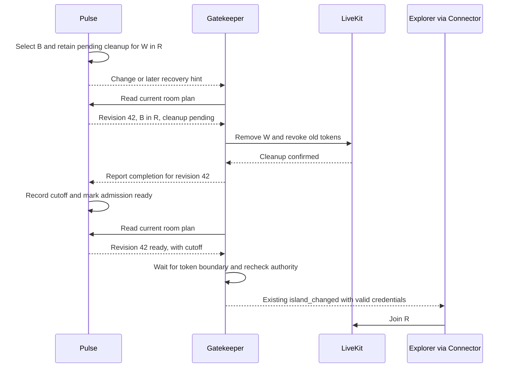

# Pulse-owned room recovery

8 October 2026. Implemented locally and independently reviewed. Local checks passed;
controlled Cloud acceptance and rollout remain open.
Supersedes the signed-metadata recommendation. One Pulse serves all users; one Gatekeeper
executes room operations. The earlier full demand-driven protocol remains superseded.

**Pulse owns the desired room, unfinished cleanup and permission to issue credentials.**
Gatekeeper executes LiveKit operations and reports their results. Explorer receives ordinary
island credentials; its parcel/profile metadata takes no part in recovery.

## The gap in PR 51

Pulse already detects the takeover. Recovery loses the information needed to finish it:

| Source | Baseline behavior | Consequence |
| --- | --- | --- |
| [ClusterTracker.SessionFor](../src/DCLPulse/Clusters/ClusterTracker.cs) | Names one previous session/room, then replaces the retained assignment. | A → B → C can lose A's unfinished cleanup. |
| [ClusterBoard.Assignments](../src/DCLPulse/Clusters/ClusterBoard.cs) and [NatsPublisher.AssignmentMessage](../src/DCLPulse/Clusters/NatsPublisher.cs) | Recovery exposes only cluster, realm and current session. | After a lost takeover event, a hint cannot reconstruct cleanup. |
| [NatsPublisher.QueueChange](../src/DCLPulse/Clusters/NatsPublisher.cs) | Coalesces per wallet; carries displacement only within the same replacement session. | The event outbox cannot serve as a room-operation ledger. |

For example, A occupies wallet W in room R. Pulse selects B, but the takeover event is lost.
The next hint says B belongs in R. Wallet-only presence then incorrectly suppresses B's
credentials. The rejected proof design tried to identify A through Explorer metadata.
Instead, retain the transition at its source and finish it before admitting B.

## Backend contract

Extend the authoritative recovery state with:

| State | Meaning |
| --- | --- |
| Epoch and revision | Identifies this room plan; changes when its desired session/room changes. Repeated hints and unchanged reconnects keep it. |
| Desired assignment | Wallet, session, realm and target cluster, or a cleanup-only record after departure. |
| Room obligations | Stable operation IDs and rooms requiring removal/revocation, including unfinished earlier transitions. |
| Admission state | `pending` or `ready`, with confirmed per-room revocation cutoffs. Ready permits credentials after bootstrap; it does not claim the client joined. |

Keep the existing changes, periodic hints and positive assignment lookup. Extend recovery to
return retained cleanup-only plans as explicit records; they never authorize minting. Add one
backend completion event carrying epoch, revision, operation ID and the effective cutoff.
Restrict its publisher to Gatekeeper. The [wire contract](https://github.com/decentraland/protocol/blob/feat/pulse-room-recovery/docs/pulse-room-recovery.md)
defines additive fields, defaults and subjects. Old or unspecified admission fails closed.

Pulse applies completions through its owning tracker, then publishes an immutable state.
An obsolete completion cannot make a newer plan ready. Recheck the live identity registration
when returning admission authority: the last completed clustering pass can lag a takeover.
Registration fences recycled slots; it does not itself make an unchanged reconnect a takeover.
Every new Pulse epoch starts with admission blocked. An operator confirms that exact epoch
after controlled room recovery; a lost or stale confirmation cannot open a later epoch.

This adds a backend cleanup acknowledgement, not a client-delivery protocol. It introduces no
new NATS request/reply chain. The existing positive lookup remains subject to the
[NATS rules](nats-usage.md): unavailable authority means defer. A separate HTTP/gRPC migration
would not remove the need for retained state and idempotent operations.

## Same-room takeover

The admission rule is essential: **every island credential path waits until Pulse records
readiness for that exact revision.** Until then, the new session cannot have received credentials
through this contract, so cleanup does not need to identify the participant through metadata.
Afterward, repeated hints preserve the participant and recover missing credentials without
repeating completed cleanup. This assumes all island token issuers obey the same rule.

## Failure behavior

- **Lost change or completion:** Pulse keeps publishing unfinished work. Gatekeeper retries or
  re-reports its confirmed result. It positively reads readiness before issuing credentials;
  publishing a completion is not sufficient.
- **Rapid takeovers:** the new plan carries all unfinished rooms and rooms previously admitted
  to the displaced owner. An older acknowledgement cannot clear newer cleanup for the same room.
  A first assignment needs no removal: bootstrap established the baseline and the room namespace
  is unique to this epoch. Once Pulse exposes readiness, it conservatively treats that room as
  authorized, even if credentials or the client's join were lost.
- **Gatekeeper restart:** read Pulse's pending/ready state and cutoffs. A crash before Pulse
  records completion requires checking the durable dispatch journal. Confirmed results can be
  re-reported; an interrupted removal has an unknown outcome and blocks the affected wallet.
  A crash after readiness preserves that result and avoids revoking the winner again.
- **Slow or failed cleanup:** calculate the cutoff immediately before LiveKit execution, after
  database and authority awaits. Use a small future margin (default five seconds). A success
  whose receive time plus the clock allowance reaches that cutoff cannot prove refreshed old
  tokens were covered; keep the durable dispatch blocked for operator reconciliation. Validate clock bounds and enforcement
  against LiveKit Cloud, including a departed participant and a room that was never joined.
  [Cloud contract](https://docs.livekit.io/intro/basics/rooms-participants-tracks/participants/#setting-an-explicit-revocation-cutoff).
- **Movement and departure:** Pulse retains the rooms it has authorized until their retirement
  is confirmed. A same-session move need not reset a room already cleared for that session;
  retirement invalidates that clearance. Returning before removal finishes remains pending.
  A takeover after readiness adds a fresh operation even for A → B → A. Departure does not expire unfinished work.
  The present 300-pass retention setting cannot stand in for completed revocation.
- **Same-second takeovers:** each new cleanup cutoff exceeds the previous admission's token
  boundary. If that would exceed Cloud's accepted future window, defer until it becomes valid.
  Wait for the replacement token's boundary plus the clock allowance before delivery, then
  recheck authority, unfinished cleanup and access. Stamp `nbf` using the lower clock bound
  while preserving Pulse's floor, so waiting cannot create another future token boundary.
- **Completed departures:** retain the last cutoff when a wallet returns quickly. Gatekeeper
  prunes confirmed receipts after reading the completed plan, then acknowledges that observation.
  Pulse forgets the departed wallet only after this acknowledgement and a 15-second clock grace
  beyond the cutoff. This covers clock differences and Gatekeeper's bounded token backdating.
  Lost observations retry through hints; uncertain removals never expire.
- **Restart storage:** bootstrap maintenance reclaims confirmed receipts from reviewed retired
  epochs. Old departed wallets cannot trigger normal per-wallet pruning after Pulse loses its
  ledger. Keep current-epoch and uncertain records; the operator procedure defines the checks.

Bound retained work and back off retries. At capacity, block affected admission and expose the
condition; dropping unresolved obligations would recreate the gap.

## Scope and honest limits

The implementation uses **controlled recovery after Pulse restart**, with admission blocked
until explicit confirmation. Room IDs include the boot epoch, so new rooms cannot alias old
counter-based IDs. Old rooms still need recovery; an epoch does not restore their history.
The first rollout needs the same procedure and can disconnect users. Seamless Pulse restart
would require persisted room state and is additional scope.

One active Gatekeeper serializes cleanup and issuance per wallet. Before each removal it writes
a dispatch record to PostgreSQL; afterward it records the confirmed result before reporting it
to Pulse. An uncertain result survives Gatekeeper restart and requires operator reconciliation.
This journal records execution, while Pulse decides ownership and readiness. It does not make
LiveKit calls atomic or fence overlapping Gatekeepers. Use the
[recovery procedure](https://github.com/decentraland/comms-gatekeeper/blob/fix/pulse-owned-room-recovery/docs/room-recovery-operations.md)
for startup and interrupted removal; actual Cloud enforcement remains an acceptance gate.

Pulse, Gatekeeper and their backend protocol need coordinated activation: an old Gatekeeper
does not understand the admission barrier. Explorer needs no recovery-proof release. In the
connector, scope deduplication to identical assignments/credentials: the baseline ten-second
room-only check can discard replacement credentials for the same room.
Explorer already caches a replacement connection string before suppressing a healthy same-room
rejoin in `ArchipelagoIslandRoom`; verify the disconnect/reconnect ordering in integration.

## Verification and release

1. **Pulse/protocol:** retain plans and completion state independently of the event outbox;
   publish pending and ready states through recovery. Test A → B → C, same-session reconnect,
   movement back into retiring rooms, departure, bootstrap, stale completions and lost/coalesced changes.
2. **Gatekeeper:** enforce the admission rule with authority and revocation checks. Test lost
   completion reports, duplicate hints before/after joining,
   crashes around dispatch/confirmation/readiness, same-second cutoffs, revocation failure,
   stale asynchronous work and shutdown with a pending call.
3. **Connector/client:** allow renewed same-room credentials through.
   Verify existing clients receive ordinary metadata and island assignments unchanged.
4. **Integration:** exercise these failures with a real broker and separately verify Cloud token
   revocation. Choose and test the Pulse restart/bootstrap procedure before rollout.

The 8 October local validation passed 1,062 Pulse tests, 1,028 Gatekeeper unit tests,
29 Gatekeeper PostgreSQL/NATS integrations, 43 connector tests and nine protocol wire tests.
Two explicit external Pulse E2E cases were not run. Cloud removal was mocked in backend tests;
actual revocation and ordinary Explorer behavior remain release acceptance requirements.
The wider presence and client migration is separate from this backend recovery contract.
